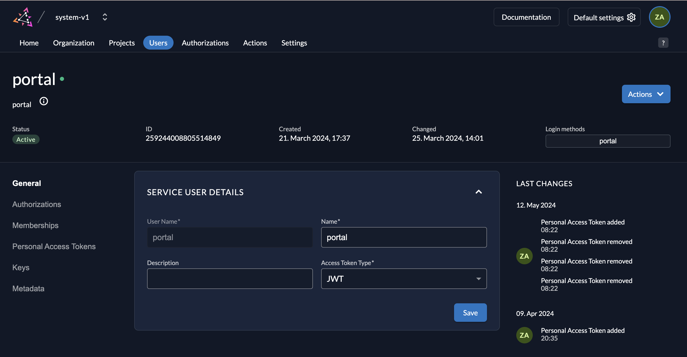
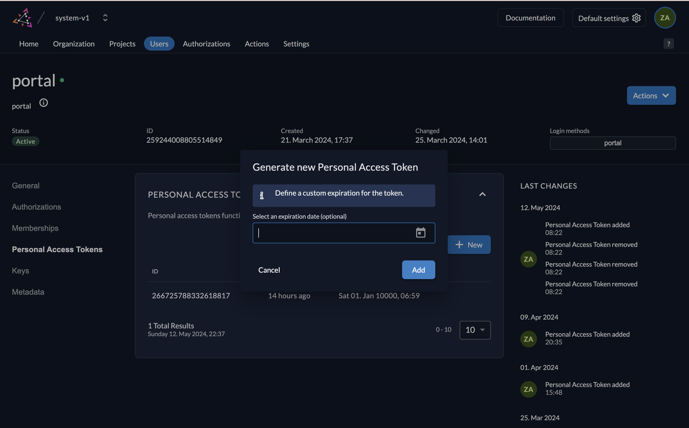

## Development

1. Clone `.env.example` file as `.env`
2. Update ZITADEL url to env `ZITADEL_URL`
3. Create service user:
   - Update service user role `IAM_OWNER` in `https://ZITADEL_URL/ui/console/instance/members`
   - Get `userId` and update to env `ZITADEL_SERVICE_USER_ID`

   

4. Create service user token: update token to env `ZITADEL_SERVICE_USER_TOKEN`

   

### Run the app

```bash
cd login
yarn install
yarn dev
```

## Run with Docker

```bash
docker run -p 3333:3333 \
  -e APP_URL=http://localhost:3333 \
  -e ZITADEL_URL=<your-zitadel-url> \
  -e ZITADEL_SERVICE_USER_ID=<service-user-id> \
  -e ZITADEL_SERVICE_USER_TOKEN=<service-user-token> \
  quochuydev/zitadel-login-ui:latest
```

## Demo

https://zitadel-login-ui-v2.vercel.app
