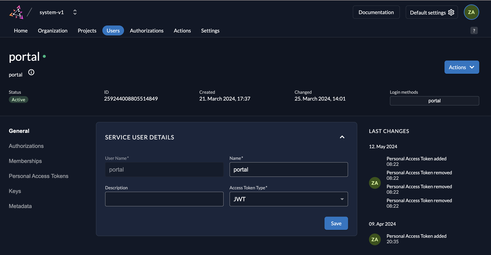
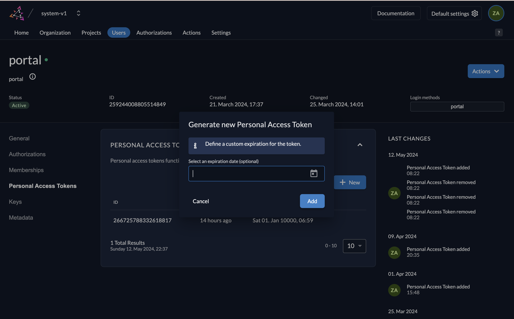

### Document

https://deepwiki.com/quochuydev/zitadel-login-ui

### Development

1. Clone `.env.example` file as `.env`
2. Update ZITADEL url to env `ZITADEL_URL`
3. Create service user:

- Update service user role `IAM_OWNER` in `https://ZITADEL_URL/ui/console/instance/members`
- Get `userId` and update to env `ZITADEL_SERVICE_USER_ID`



**Run the app**

```bash
yarn dev
```

#### IV.Create service user token: update token to env `ZITADEL_SERVICE_USER_TOKEN`



**Example**

https://zitadel-login-ui-v2.vercel.app
